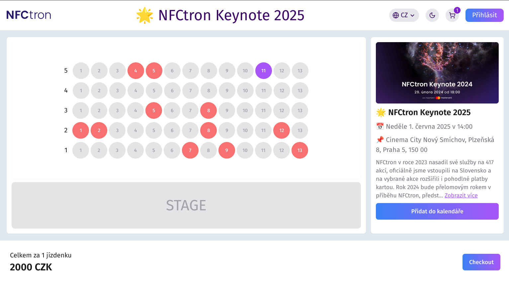
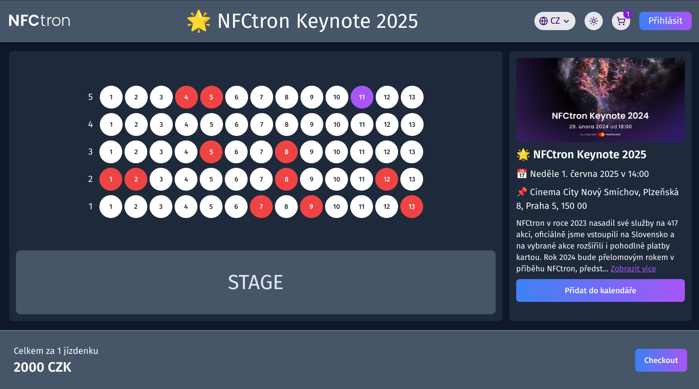

# 💻 NFCtron Frontend Case Study (Seating)

> 👋 Tento projekt pre pozíciu ⚛️ **Frontend Developer** v **NFCtron** zahŕňal dokončenie **React** aplikácie pre nákup vstupeniek. Mojou úlohou bolo vytvoriť funkčnú, prehľadnú a používateľsky prívetivú aplikáciu s čistým kódom, využívajúc React, správu stavu a tvorbu UI komponentov. 🚀

## 🔹High-Level popis aplikácie

Táto jednoduchá **SPA (Single Page Application)** umožňuje nákup vstupeniek na podujatie s intuitívnym rozhraním. Užívatelia môžu prehliadať mapu sedadiel, pridávať alebo odoberať vstupenky z košíka, sledovať cenu, prihlásiť sa a dokončiť objednávku vyplnením údajov, s možnosťou pokračovať ako hosť. Po odoslaní objednávky sa zobrazí potvrdenie alebo informácia o chybe. Aplikácia ponúka aj rozšírenia, ako **multilanguage, dark mode, časovač v checkoute, pridanie podujatia do kalendára a správu košíka priamo v menu**, čím zlepšuje užívateľský zážitok.

|             Light mode             |             Dark mode             |
| :--------------------------------: | :-------------------------------: |
|  |  |

## 🔹 Features

- [x] možnosť prepínať medzi **dark a light mode**
- [x] možnosť prepínať medzi 4 jazykmi **(cz, en, fr, de)**
- [x] možnosť vymazať vstupenku z košíka v menu
- [x] možnosť pridať udalosť do **Google kalendára**
- [x] možnosť **login/logout** alebo pokračovať ako **"hosť"**
- [x] onepage **detail udalosti** získaný z API
- [x] mapa dostupných sedadiel **(rada, sedadlo) z API**
- [x] **pridanie / odobranie sedadla** z košíka po kliknutí
- [x] aktuálny počet vstupeniek v košíku a ich celková hodnota
- [x] 5 minutový **časovač** v checkout zóne
- [x] **vytvorenie objednávky** cez API a zobrazenie výsledku (úspech/chyba)
- [x] **responzivita** na mobilných zariadeniach

## 🔹Technológie

- language: **Typescript**
- framework: **React**
- UI: **Tailwindcss, Radix UI, Lucide Icons**
- routing: **React Router**
- state management: **context API + reducer hook**
- performance: **Suspense + lazy loading**
- multilanguage: **React i18next**

## 🔹Postup

### 👤 Header

Header aplikácie obsahuje **logo, title a menu**. Title je získavaný z API. Menu je tvorené zo 4 features → **multilanguage, dark mode, cart a login**.

Keďže sa jednalo o malú aplikáciu a potrboval som **viacero globálnych stavov**, tak pre **state management** v celej aplikácii som sa rozhodol použiť **context API** spolu s **useReducer hook**. Ak by bola aplikácia väčšia a potreboval by som viac rôznych a komplexnejších "state managements", tak použil by som **RTK (Redux Toolkit)**. Týmto spôsobom by som zamedzil vzniku tzv. "context hell".

Pre **multilanguage** feature som použil package **React-18next**.

Pre správu **tmavého režimu** som aplikoval vlastný **custom hook**, ktorý prepína medzi light a dark režimom.

**Košík** obsahuje pridané vstupenky - v prípade, že je prázdny, tak obsahuje hlášku v zmysle "váš košík je prázdny". Je tam možnosť mazať vstupenky z košíka po jednom alebo **zmazať celý košík** na jeden klik. Tiež ak sa user nachádza v poslednej fáze - v checkout zóne, tak cart ma vyššie spomenuté funkcia vypnuté a nie je možné ním manipulovať. Tiež po úspešnom odoslaní objednávky sa košík **resetuje**.

**Login/Logout** je riešený pomocou context API, kde ak user zadá nesprávne prihlasovacie údaje alebo stratí internetové pripojenie dostane chybovú hlášku.

- Email: frontend@nfctron.com
- Password: Nfctron2025

---

### 🎫 Main

Hlavná časť aplikácie je rozdelená na 2 časti:

1. výber miesta na sedenie
2. detaily udalostí s možnosťou pridania do Google kalendára

Všetky informácie o sedení a o udalosti sú stiahnuté z API a následne renderované do stránky. Miesta vyplnené červenou farbou znázorňujú obsadené miesta. Po kliknutí na miesto má user možnosť pridať alebo odobrať miesto z košíka.

Popis udalosti využíva efektívne **rozbaľovanie textu**.

Udalosť pridať do kalendára je možná ak sa user prihlási do svojho Google účtu, v tom prípade si môže udalosť pridať do svojho **Google kalendára**.

**Footer** obsahuje výslednú cenu, počet vstupeniek v košíku a tlačidlo **Checkout**. Tiež sa zobrazuje len v prípade ak je v košíku aspoň jedna položka.

**Checkout button** ponúka 2 možnosti:

1. ak je user prihlásený, tak ho presmeruje rovno do checkout zóny
2. ak nie je prihlásený, tak bude presmerovaný na novú route → /login

V **login page** sa user môže prihlásiť pomocou svojich údajov alebo pokračovať ako **hosť**. Ak sa prihlási, tak inputy v checkout sa automaticky vyplnia podľa login údajov daného používateľa.

---

### 🛒 Checkout

Checkout zóna obsahuje polia na vyplnenie, ktoré sa odošlú na server. Chybová hláška sa zobrazí v prípade, že user nevyplní email, ktorý je povinný alebo stratí internetové spojenie.

Ak sa user odhlási počas toho ako je v checkout zóne, tak systém ho vyhodí z checkout a presmeruje na domovskú stránku.

**Timer** je nastavený na 5 minút, ak vyprší, tak user bude presmerovaný na domovskú stránku a košík sa restuje.

Ak je odoslanie úspešne, tak user dostane správu o úspešnom odoslaní, košík sa resetuje a tým je celý **scope ukončený**.

---

_–– by Daniel 👨🏻‍💻_
